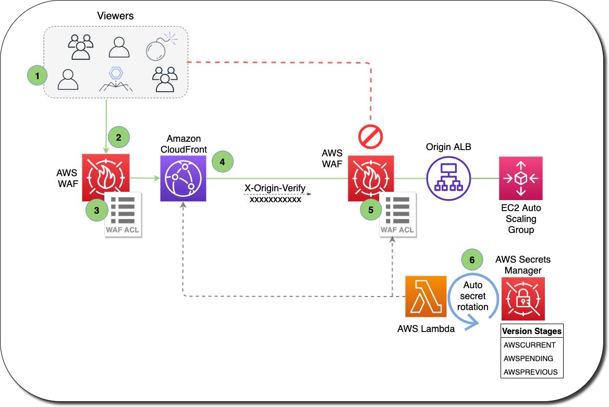

## Enhance Amazon CloudFront Origin Security with AWS WAF and AWS Secrets Manager

This repository includes a sample solution you can deploy to see how its components integrate to implement the origin access restriction. The sample solution includes a web server deployed on Amazon EC2 Linux instances running in an Amazon EC2 Autoscaling group. Elastic Load Balancing distributes the incoming application traffic across the EC2 instances using an ALB. The ALB is associated with an AWS WAF web access control list (ACL) which is used to validate the incoming origin requests. Finally, a CloudFront distribution is deployed with an AWS WAF web ACL and configured to point to the origin ALB.

Although the sample solution is designed for deployment with CloudFront with an AWS WAF associated ALB as its origin, the same approach could be used for origins using Amazon API Gateway. A custom origin is any origin that is not an Amazon S3 bucket, with one exception. An Amazon S3 bucket that is configured with static website hosting is a custom origin. You can refer to [our documentation](https://docs.aws.amazon.com/AmazonCloudFront/latest/DeveloperGuide/SecurityAndPrivateContent.html) for more information on securing content that CloudFront delivers from S3 origins. 

This solution is intended to enhance security for CloudFront custom origins that support AWS WAF, such as ALB, and is not a substitute for authentication and authorization mechanisms within your web applications. In this solution, Secrets Manager is used to control, audit, monitor, and rotate a random string used within your CloudFront and AWS WAF configurations. Although most of these lifecycle attributes could be set manually, Secrets Manager makes it easier.

_Note: The sample solution requires deployment in the N. Virginia (us-east-1) region. An [additional sample template](templates/cf-origin-verify-sm-only.yaml) is available for testing this solution with an existing CloudFront distribution and regional WAF web ACL.

### Solution diagram

Here’s how the solution works, as shown in the diagram:

1.	A viewer accesses your website or application and requests one or more files, such as an image file and an HTML file. 
2.	DNS routes the request to the CloudFront edge location that can best serve the request—typically the nearest CloudFront edge location in terms of latency.
3.	At the edge location, AWS WAF inspects the incoming request according to configured web ACL rules.
4.	At the edge location, CloudFront checks its cache for the requested content. If the content is in the cache, CloudFront returns it to the user. If the content isn’t in the cache, CloudFront adds the custom header, X-Origin-Verify, with the value of the secret from Secrets Manager, and forwards the request to the origin.
5.	At the origin Application Load Balancer (ALB), AWS WAF inspects the incoming request header, X-Origin-Verify, and allows the request if the string value is valid. If the header isn’t valid, AWS WAF blocks the request.
6.	At the configured interval, Secrets Manager automatically rotates the custom header value and updates the origin AWS WAF and CloudFront configurations.

## Security

See [CONTRIBUTING](CONTRIBUTING.md#security-issue-notifications) for more information.

## License

This library is licensed under the MIT-0 License. See the LICENSE file.

